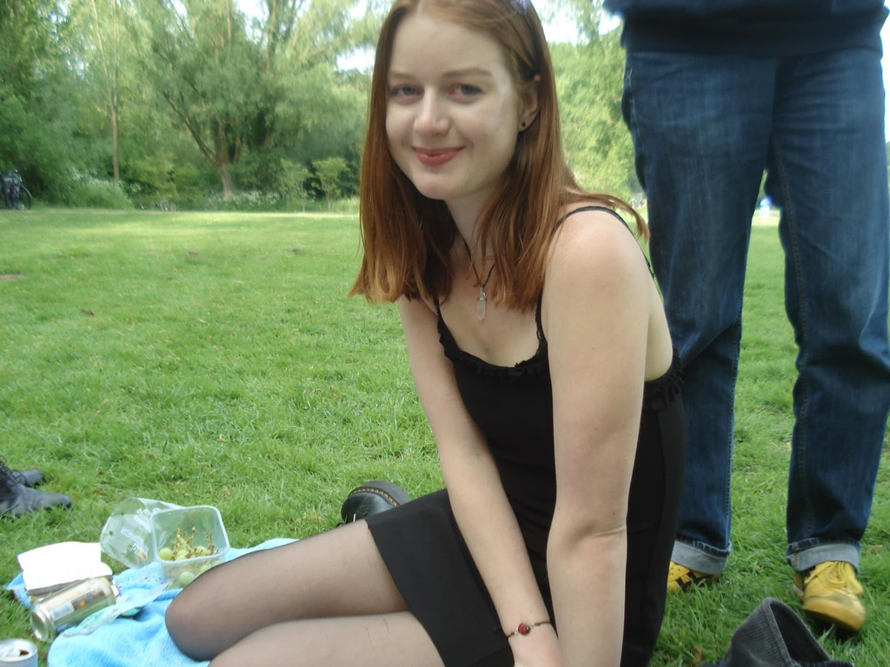

  

    
  

  

    
hi, my name is Lola! I'm a poet from Amsterdam.

    
To me, writing is healing. It's also falling in love again, with life itself.

    
"One does not become enlightened by imagining figures of light, but making the darkness conscious." — C.G. Jung

  

